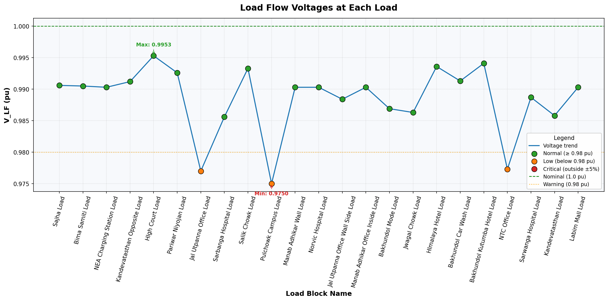

# SANEPA FAULT
Added Load Flow only on Kandevtasthan opposite

Added Load Flow upto Pulchowk Campus

Slight drop in voltage is seen as we keep adding the load.
## After completion of all the loads

The load graph is shown as: 

Blue line — voltage trend connecting the loads

Green dots — loads at normal voltage (≥ 0.98 pu)

Orange dots — loads with low voltage (below 0.98 pu) — Jal Utpanna Office, Pulchowk Campus, and NTC Office Loads

Green dashed line — nominal voltage (1.0 pu)

Orange dotted line — warning threshold (0.98 pu)

Annotations — max (High Court Load: 0.9953) and min (Pulchowk Campus Load: 0.9750)

A red category for critical voltages (outside ±5%) is defined in the legend in case future runs of load flow produce values that severe.

## Branch Priortization

| # | Sub-feeder name (by load cluster) | Approx. load served | Distribution transformers on it | Comments |
| :--- | :--- | :--- | :--- | :--- |
| 1 | Kandevatasthan / Bima Samiti lateral (west-southwest) | ~165 kW | Kandebata Sthan 300 kVA, Bima Samiti 200 kVA, Sarbanga Hospital 200 kVA | Long lateral going southwest  has the largest single load (Kandevatasthan, 68.8 kW) |
| 2 | Pulchowk / Bakhundol lateral (central-south) | ~245 kW | Pulchowk Campus Wall 100 kVA, Bakhundol Mode 300 kVA, Bakhundol Car Wash 200 kVA, Bakhundol Kutumba 200 kVA | Densest cluster includes the second largest LV transformer (300 kVA Bakhundol Mode) and contains 4 transformers |
| 3 | Sarwanga Hospital / Pariwar Niyojan / High Court lateral (south) | ~122 kW | Sarwanga Hospital 300 kVA, Pariwar Niyojan 100 kVA, High Court 200 kVA | Critical loads (hospital + court)  strong candidate for solar siting and protection priority |
| 4 | NTC / Sajha / NEA / Manab Adhikar / Labim corridor (east, the longest path) | ~250 kW | NTC Office, Sajha 500 kVA, NEA Charging Station 200 kVA, three more 200 kVA transformers, Norvic Hospital, Labim Mall | The longest electrical distance from source voltage drop is worst here, includes the biggest single transformer (Sajha 500 kVA) |
| 5 | Jal Utpanna lateral (southeast) | ~70 kW | Jal Utpanna 100 kVA + wallside load | Short lateral off the eastern corridor |

# Update by Santosh

## Project Update

The updated simulation model has been pushed to GitHub at:

/Santosh/Sanepa_overall_model_Fault.slx

The complete dataset, including the extracted wavelet features, has also been added at:

/Santosh/dataset.xlsx

## Simulation Details

The simulation was performed for a total time of 5 seconds.

The fault was applied from 1 second to 2 seconds.

The fault type used in this case was ABCG fault.

## Signals Used

The updated model includes current and voltage signals such as:

ia, ia1, ia2, ia3  
ib, ib1, ib2, ib3  
ic, ic1, ic2, ic3  

va, va1, va2, va3  
vb, vb1, vb2, vb3  
vc, vc1, vc2, vc3  

These signals were collected from the Simulink model and used for wavelet-based feature extraction from differnet branch.

## Wavelet Transform Information

The selected wavelet was db4.

The decomposition level used was Level 4.

For each signal, four detail coefficients were extracted:

D1, D2, D3, D4

Where:

- D1 represents the highest-frequency detail component.
- D2 represents the second-level detail component.
- D3 represents the third-level detail component.
- D4 represents the fourth-level detail component.

## Dataset Information

The generated dataset includes both original simulation signals and their corresponding wavelet coefficients.

For each signal, the dataset contains:

Original Signal  
D1 Wavelet Coefficient  
D2 Wavelet Coefficient  
D3 Wavelet Coefficient  
D4 Wavelet Coefficient  

Example:

ia, D1_ia, D2_ia, D3_ia, D4_ia  
ib, D1_ib, D2_ib, D3_ib, D4_ib  
ic, D1_ic, D2_ic, D3_ic, D4_ic  
va, D1_va, D2_va, D3_va, D4_va  
vb, D1_vb, D2_vb, D3_vb, D4_vb  
vc, D1_vc, D2_vc, D3_vc, D4_vc  

The dataset is stored at:

/Santosh/dataset.xlsx
